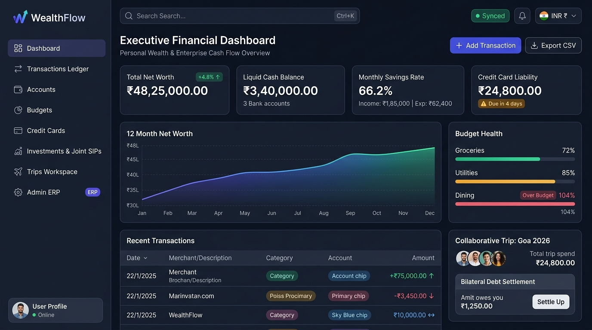

# WEALTHFLOW — ADMIN & ERP UI DESIGN SYSTEM
**Document Version:** 1.0.0  
**Status:** Under Review  
**Target Delivery:** Design System & UI Specifications V1.0  
**Primary Currency Display:** Indian Rupee (INR - ₹) with Lakh/Crore Grouping  
**Accessibility Target:** WCAG 2.1 AA  

---

## 1. Design Philosophy & Core Principles

WealthFlow's design system bridges personal financial clarity with enterprise ERP data density. It is engineered around five foundational tenets:

1. **Absolute Financial Trust:** Financial data must be crystal-clear, unambiguously formatted, and immune to visual misinterpretation. No ambiguous abbreviations or unformatted raw numbers.
2. **Information Density with Breathing Room:** Financial users require immediate access to dense tables and metrics without feeling overwhelmed. We utilize a strict 4px grid and clean typography to maximize screen efficiency.
3. **Non-Color Reliance (Accessibility First):** Colors reinforce semantic meaning, but **never convey information alone**. Every positive, negative, warning, or pending state is accompanied by directional icons, symbols (`+`, `-`, `↔`), and explicit ARIA labels.
4. **Ergonomic Speed & Frictionless Entry:** Frequent tasks (e.g., recording a ₹40 coffee or splitting a dinner bill) must require fewer than three taps/clicks or a single keyboard shortcut (`Ctrl+K`).
5. **Deterministic Visual Hierarchy:** High-impact metrics (Net Worth, Total Liquid Cash, Budget Breaches) dominate the primary focal plane, while granular transaction metadata recedes gracefully.
6. **Universal Single Styling Layout Invariant:** Exactly **one styling layout is enforced across the entire application**. Bespoke card styling, ad-hoc font scales, diverging margins, or custom page shells are strictly forbidden. All personal finance views, collaborative trips, user settings, and Admin ERP consoles share the exact same `AppLayout`, `PageHeader`, 12-column grid, and card/table token geometry.

---

### Reference Architecture & Visual Blueprint


---

## 2. Design Tokens

### 2.1 Color Palette & Semantic System
WealthFlow utilizes a tailored color palette built on Tailwind CSS semantics, designed for both light and dark modes with high contrast.

```
┌────────────────────────────────────────────────────────────────────────┐
│                        SEMANTIC COLOR MAPPING                          │
├───────────────────┬───────────────────┬────────────────────────────────┤
│ Role              │ Hex Token         │ Semantic Purpose               │
├───────────────────┼───────────────────┼────────────────────────────────┤
│ Primary Brand     │ #4F46E5 (Indigo)  │ Primary CTAs, active tabs      │
│ Inflow / Positive │ #10B981 (Emerald) │ Income, Positive Net Balance   │
│ Outflow / Expense │ #F43F5E (Rose)    │ Expenses, Liabilities, Debts   │
│ Warning / Alert   │ #F59E0B (Amber)   │ Budget 80-89%, Advances, Due   │
│ Critical / Exceed │ #EF4444 (Red)     │ Budget 100%+, Overdraft        │
│ Neutral Transfer  │ #0284C7 (Sky)     │ Account Transfers, Investments │
│ Collaboration     │ #8B5CF6 (Violet)  │ Shared Trips, Guest Links      │
│ Surface (Dark)    │ #0F172A (Slate)   │ Dark mode root canvas          │
│ Surface (Light)   │ #F8FAFC (Slate)   │ Light mode root canvas         │
└───────────────────┴───────────────────┴────────────────────────────────┘
```

### 2.2 Typography
- **Primary Interface Font:** `Inter`, `-apple-system`, `BlinkMacSystemFont`, `Segoe UI`, `sans-serif`. Used for labels, headings, buttons, and navigation.
- **Monospaced / Financial Numbers Font:** `JetBrains Mono`, `Fira Code`, `ui-monospace`, `monospace`.
- **Tabular Figures Rule:** All monetary amounts, balances, and dates **must** render with `font-mono font-variant-numeric: tabular-nums;` to guarantee vertical alignment in tables and cards.

| Token | Size | Line Height | Weight | Usage |
| :--- | :--- | :--- | :--- | :--- |
| `text-display` | 32px (2.0rem) | 38px | Bold (700) | Net Worth Hero Metric |
| `text-h1` | 24px (1.5rem) | 32px | Bold (700) | Page Titles, Account Totals |
| `text-h2` | 20px (1.25rem)| 28px | SemiBold (600) | Card Headers, Section Titles |
| `text-h3` | 16px (1.0rem) | 24px | SemiBold (600) | Table Column Headers, Modal Titles |
| `text-body` | 14px (0.875rem)| 20px| Regular (400) | Table Cells, Descriptions, Inputs |
| `text-caption` | 12px (0.75rem)| 16px | Medium (500) | Timestamps, Badges, Micro-labels |

### 2.3 Spacing Scale (Strict 4px Grid)
All layout padding, margins, gaps, and heights strictly adhere to the 4px baseline scale:
- `space-1`: 4px
- `space-2`: 8px
- `space-3`: 12px
- `space-4`: 16px
- `space-5`: 20px
- `space-6`: 24px
- `space-8`: 32px
- `space-10`: 40px
- `space-12`: 48px

### 2.4 Border Radii & Elevation (Shadows)
- **Radii:** `rounded-sm` (4px), `rounded-md` (6px), `rounded-lg` (8px), `rounded-xl` (12px), `rounded-full` (9999px for pills/avatars).
- **Elevation Tokens:**
  - `shadow-sm`: Subtle border elevation for interactive table rows and inputs.
  - `shadow-md`: Standard elevation for dashboard cards and widget containers.
  - `shadow-xl`: Deep elevation with backdrop blur for modals, drawers, and Quick Add dialogs.

---

## 3. Financial Formatting & Display Rules

### 3.1 The Indian Numbering System (Lakhs & Crores)
WealthFlow enforces the standard Indian numbering format where commas group the initial three digits and every two digits thereafter:

```text
₹100.00         (Hundred)
₹1,000.00       (Thousand)
₹10,000.00      (Ten Thousand)
₹1,00,000.00    (One Lakh)
₹10,00,000.00   (Ten Lakhs)
₹1,00,00,000.00 (One Crore)
```

- **Implementation Standard:** Uses `Intl.NumberFormat('en-IN', { style: 'currency', currency: 'INR' })`.
- **Negative Financial Display:** Displayed with an explicit minus sign before the currency symbol or enclosed in parentheses: `-₹2,500.00` or `(₹2,500.00)`.

### 3.2 Directional & Semantic Signage

```text
Income / Inflow:      [ + ₹15,000.00 ↑ ]  (Emerald text + Plus + Up Arrow)
Expense / Outflow:     [ - ₹2,400.00  ↓ ]  (Rose text + Minus + Down Arrow)
Account Transfer:      [   ₹10,000.00 ↔ ]  (Sky text + Bidirectional Arrow)
Credit Card Debt:      [ - ₹18,250.00 💳 ] (Rose text + Card Icon)
Settlement (Owed To):  [ + ₹3,000.00  ✓ ]  (Green text + Check Icon)
Settlement (Owes):     [ - ₹2,000.00  ⚠ ]  (Amber text + Warning Icon)
```

---

## 4. Core Reusable Component Library (Component-Based Architecture)

All components are strictly built using **Component-Based Architecture (CBA)**, categorized by atomic responsibility:

```
┌─────────────────────────────────────────────────────────────────────────┐
│                    WEALTHFLOW CORE COMPONENT SUITE (CBA)                │
├───────────────────┬───────────────────┬─────────────────────────────────┤
│ Tier 1: Atoms     │ Tier 2: Molecules │ Tier 3: Organisms & Templates   │
├───────────────────┼───────────────────┼─────────────────────────────────┤
│ - Button          │ - MoneyInput      │ - TransactionRow (Organism)     │
│ - Input           │ - FormField       │ - JointSipCard (Organism)       │
│ - MoneyDisplay    │ - DateRangePicker │ - SipReconciliationRow (Organism│
│ - Badge           │ - SearchInput     │ - SplitEditor (Organism)        │
│ - Icon            │ - ConfirmDialog   │ - CreditCardCard (Organism)     │
│ - ProgressBar     │ - CategorySelect  │ - DataTable (ERP High-Density)  │
│ - SyncStatusPill  │ - TripMemberBadge │ - AppLayout (Template)          │
│                   │                   │ - MobileNavDrawer (Template)    │
└───────────────────┴───────────────────┴─────────────────────────────────┘
```

### 4.1 `MoneyInput` (Currency Input Component)
- **Behavior:**
  - Prefix fixed to `₹`.
  - Automatically formats with Indian comma groupings as user types or on blur.
  - Restricts input strictly to numbers and a single decimal point (max 2 decimal places).
  - Rejects negative values by default (unless explicitly configured for adjustments).
  - Prominent font size (`text-xl` or `text-2xl` inside quick-entry modals).

### 4.2 `MoneyDisplay` (Semantic Text Component)
- **Variants:** `display` (32px), `headline` (20px), `body` (14px), `caption` (12px).
- **Properties:**
  - `amount`: `number` or `string` (`decimal(18,2)`).
  - `type`: `income` | `expense` | `transfer` | `neutral` | `auto`.
  - `showSign`: `boolean` (renders `+` or `-`).
  - `showIcon`: `boolean` (renders `↑`, `↓`, `↔`).

### 4.3 `BudgetProgress` (Multi-Threshold Visual Meter)
- Visual bar with animated progress filling from 0% to 100%+.
- **Dynamic Threshold Color Shifts:**
  - `0% - 79.9%`: Green (`bg-emerald-500`).
  - `80% - 89.9%`: Amber warning (`bg-amber-500`).
  - `90% - 99.9%`: Orange critical (`bg-orange-500`).
  - `>= 100%`: Red exceeded (`bg-rose-500`) with blinking pulse and text indicator: `₹1,200 Over Budget`.

### 4.4 `CreditCardCard` (Liability Visualizer)
- Renders a stylized card with physical aspect ratio ($1.586 : 1$).
- Shows Bank Name, Card Name, Masked Number (`•••• 4821`), Chip graphic, and Available Credit.
- Progress bar at the bottom displaying credit utilization percentage.
- Due date pill badge highlighting days remaining until due date.

### 4.5 `SplitEditor` (Dynamic Split Allocation Table)
- Embedded inside Trip Expense dialogs.
- Supports four mode tabs: `[Equal]`, `[Unequal]`, `[Percentage]`, `[Shares]`.
- Displays real-time allocation status banner:
  - *Balanced:* Green badge `✓ Total matches expense: ₹4,000.00`.
  - *Unbalanced:* Red warning `⚠ Remaining to allocate: ₹500.00`. Form submit is strictly disabled.

### 4.6 `DeviceSessionCard` (Session Management Component)
- Renders an individual authorized device card inside `/settings/sessions`:
  - Device Icon: Desktop/Laptop, Mobile, or Tablet icon based on `DeviceType`.
  - Header: Device Name & Browser (e.g., *"MacBook Pro — Chrome"*).
  - Status Indicators:
    - Current Device: `[This Device]` green badge.
    - Activity: Green dot with *"Active Now"* or *"Last active: 2 hours ago"*.
  - Metadata row: IP Address (e.g., `103.21.201.x`), City/Region, Login Date.
  - Action Button:
    - If current device: disabled or opens standard "Log Out" flow.
    - If other device: `[Revoke Session]` button with red outline and confirmation prompt.

### 4.7 `TripSummaryMatrix` & `SettleUpCard` (Google Pay Style)
- **`TripSummaryMatrix`:**
  - High-density tabular grid rendered on Trip Summary view.
  - Displays avatar, member name, `Total Spent` (out-of-pocket cash paid), `Fair Share Owed`, and `Net Balance`.
  - Visual status pill:
    - `+ ₹1,875.00` in bold Emerald with `Gets Back` label.
    - `- ₹625.00` in bold Rose/Amber with `Owes` label.
    - `₹0.00` in muted Slate with `Settled` checkmark.
- **`SettleUpCard` (Direct "Who Pays Whom" Card):**
  - Card layout: Debtor Avatar + Name ──► Arrow Icon ──► Creditor Avatar + Name.
  - Prominent Amount: e.g., `₹625.00` (`font-mono font-bold text-lg`).
  - Action CTA: `[Settle Up]` primary button (triggers payment confirmation modal with UPI reference / cash note).

### 4.8 `JointSipCard` & `SipReconciliationRow` (Co-Funded Investment Visualizer)
- **`JointSipCard` (Shared Asset Visualizer):**
  - Card Header: Target Fund Name, Active Status Pill (`Active` in Emerald / `Paused` in Amber), and Dual-Ownership Badge: `bg-violet-100 text-violet-800 dark:bg-violet-900/30 dark:text-violet-300` with `Users` icon.
  - Contribution Split Meter: Visual segmented bar:
    - User Equity: Indigo segment (`₹7,500 / 50%`) with tooltip *"Your true portfolio asset"*.
    - Co-Investor Share: Violet segment (`₹7,500 / 50%`) with tooltip *"Booked as receivable from Brother"*.
  - Metadata: Next debit date, source bank account name, total monthly debit.
- **`SipReconciliationRow` (Bilateral Cycle Ledger):**
  - Rendered in high-density table inside joint SIP detail view:
    - `Cycle / Month`: `font-medium text-slate-800 dark:text-slate-100` (e.g., "October 2026").
    - `Execution Date`: `font-mono text-xs text-slate-500` (e.g., "05-10-2026").
    - `Total Debited`: `font-mono text-slate-700` (`₹15,000.00`).
    - `Partner Share Due`: `font-mono font-semibold text-rose-600 dark:text-rose-400` (`₹7,500.00`).
    - `Amount Settled`: `font-mono text-emerald-600 dark:text-emerald-400` (e.g. `₹7,500.00` or `₹0.00`).
    - `Status Badges`:
      - `Pending`: Amber pill (`bg-amber-100 text-amber-800 dark:bg-amber-900/30 dark:text-amber-300`) with clock icon.
      - `Partially Settled`: Sky pill (`bg-sky-100 text-sky-800 dark:bg-sky-900/30 dark:text-sky-300`) with progress text.
      - `Settled`: Emerald pill (`bg-emerald-100 text-emerald-800 dark:bg-emerald-900/30 dark:text-emerald-300`) with checkmark.
    - `Action`: One-click `[Record Repayment]` CTA button triggering modal with UPI reference input and mutual debt offset selector.

---

## 5. Universal Layout & Page Anatomy Blueprint

To ensure the user experiences a cohesive and predictable UI throughout the entire application, every single view strictly implements the **Universal Page Blueprint**:

### 5.1 Page Shell Tokens & Geometry
- **Outer Shell Wrapper (`PageContainer`):**
  - CSS Classes: `w-full max-w-7xl mx-auto px-4 sm:px-6 lg:px-8 py-6 space-y-6`
  - Ensures identical horizontal gutters and vertical rhythmic cadence across all viewports.
- **Unified Header (`PageHeader`):**
  - Container: `flex flex-col sm:flex-row sm:items-center sm:justify-between gap-4 pb-4 border-b border-slate-200 dark:border-slate-800`
  - Title: `text-2xl font-bold tracking-tight text-slate-900 dark:text-white`
  - Subtitle: `text-sm text-slate-500 dark:text-slate-400 mt-1`
  - Action Slot: Right-aligned button group for primary and secondary actions (e.g. `(+) Add Transaction`, `[Export CSV]`).
- **Standardized Metric / KPI Strip:**
  - Container: `grid grid-cols-2 lg:grid-cols-4 gap-4`
  - Card: `bg-white dark:bg-slate-900 border border-slate-200 dark:border-slate-800 rounded-xl p-4 shadow-sm`
  - Value: `text-xl sm:text-2xl font-bold font-mono tabular-nums text-slate-900 dark:text-white`
  - Delta / Badge: Semantic pills (`bg-emerald-50 text-emerald-700` or `bg-rose-50 text-rose-700`).
- **Standardized 12-Column Responsive Content Grid:**
  - Container: `grid grid-cols-1 lg:grid-cols-12 gap-6 items-start`
  - Primary Workspace: `lg:col-span-8 space-y-6` (hosts primary data table, transaction feed, or chart visualizer).
  - Secondary Workspace: `lg:col-span-4 space-y-6` (hosts filter widgets, summary cards, or quick mutation forms).
  - Full-Width Variant: `lg:col-span-12` (used for comprehensive high-density ERP data tables).
- **Universal Card Container Anatomy (`Card`):**
  - Container: `bg-white dark:bg-slate-900 border border-slate-200 dark:border-slate-800 rounded-xl shadow-sm overflow-hidden`
  - Header (`CardHeader`): `px-6 py-4 border-b border-slate-200 dark:border-slate-800 flex items-center justify-between`
  - Body (`CardBody`): `p-6`
  - Footer (`CardFooter`): `px-6 py-3 bg-slate-50 dark:bg-slate-800/40 border-t border-slate-200 dark:border-slate-800 flex justify-end gap-3`

### 5.2 Mobile Navigation Drawer Specification (`MobileNavDrawer`)
- **Trigger:** Accessible Hamburger menu button (`[≡]`) positioned on the top left of the mobile header.
- **Backdrop:** `fixed inset-0 bg-slate-900/60 backdrop-blur-sm z-40 transition-opacity duration-300`.
- **Drawer Container:** `fixed inset-y-0 left-0 w-72 max-w-[85vw] bg-white dark:bg-slate-900 shadow-2xl z-50 flex flex-col transform transition-transform duration-300 ease-in-out`.
- **Anatomy:**
  - Header: Application brand logo + bold title + `[✕ Close]` button.
  - User Profile Snippet: Avatar + Name + Email + Role Badge (`Admin` / `User`).
  - Navigation Scroll Area: Complete list of all application links matching the desktop sidebar (Dashboard, Ledger, Accounts, Budgets, Credit Cards, Investments, Loans, Trips, Analytics, Settings, Sessions, Admin ERP).
  - Footer: Online status pill and explicit `[Log Out]` button.
- **Screen Benefit:** Completely replaces cluttered mobile bottom tab bars, reclaiming 100% of vertical mobile viewport height for financial data and ledger inspection while keeping all navigation items 1-tap accessible.

---

## 6. Admin & ERP Screen Specifications

WealthFlow's administrative and operational interfaces **strictly share the exact same `AppLayout`, 4px spacing scale, color palette, typography tokens, and card container geometry** as consumer features, ensuring a unified visual identity and zero design divergence.

```
┌─────────────────────────────────────────────────────────────────────────────────────────────────────────────────┐
│                                       ADMIN COMMAND CENTER (`/admin/dashboard`)                                 │
├─────────────────────────────────────────────────────────────────────────────────────────────────────────────────┤
│ TOP HEADER: App Logo | System Status: [● Operational] | DB: PostgreSQL 16 | Admin: rahul | [≡ Drawer]           │
├─────────────────────────────────────────────────────────────────────────────────────────────────────────────────┤
│ PAGE HEADER: Admin Command Center — System Health, Live Telemetry & ERP Operations                              │
│ Action Buttons: [Trigger Sync Sweep]  [Export Audit Logs]  [Diagnostics]                                        │
├─────────────────────────────────────────────────────────────────────────────────────────────────────────────────┤
│ STANDARDIZED SYSTEM METRIC / KPI STRIP (4 Standard Metric Cards)                                                │
│ ┌──────────────────────┐ ┌──────────────────────┐ ┌──────────────────────┐ ┌──────────────────────────────────┐ │
│ │ Total Users & Sess.  │ │ PostgreSQL DB Health │ │ Sync Throughput      │ │ 24h Security & Audit Events      │ │
│ │ 1 User / 3 Sessions  │ │ Pool: 4/50 | p95:12ms│ │ 1,420 msgs | 145ms lt│ │ 284 Mutations | 0 Failures    │ │
│ │ [✓ Singleton Admin]  │ │ Size: 42.8 MB        │ │ Conflict: 0.04% (0 DL│ │ [● 0 Failed Logins]              │ │
│ └──────────────────────┘ └──────────────────────┘ └──────────────────────┘ └──────────────────────────────────┘ │
├─────────────────────────────────────────────────────────────────────────────────────────────────────────────────┤
│ 12-COLUMN RESPONSIVE OPERATIONAL WORKSPACE                                                                      │
│ ┌─────────────────────────────────────────────────────────────┐ ┌─────────────────────────────────────────────┐ │
│ │ PRIMARY WORKSPACE (lg:col-span-8)                           │ │ OPERATIONAL SIDEBAR (lg:col-span-4)         │ │
│ │ ┌─────────────────────────────────────────────────────────┐ │ │ ┌─────────────────────────────────────────┐ │ │
│ │ │ LIVE MUTATION & CLIENT SYNC STREAM                      │ │ │ │ SINGLETON ADMIN INVARIANT MONITOR         │ │ │
│ │ │ [Filters: All Entities | All Statuses | Search Actor]   │ │ │ │ Status: [✓ Invariant Enforced (Count = 1)]│ │ │
│ │ │ ┌────────┬─────────────┬──────────┬──────────┬────────┐ │ │ │ │ Admin: adm***@wealthflow.local            │ │ │
│ │ │ │ Time   │ Actor       │ Entity   │ Op Type  │ Status │ │ │ │ DB Constraint: UX_Users_SingleAdmin     │ │ │
│ │ │ ├────────┼─────────────┼──────────┼──────────┼────────┤ │ │ │ │ Elevation Route: Disabled / 403 Hard  │ │ │
│ │ │ │ 11:24  │ test@local  │ Txn #82  │ INSERT   │ Synced │ │ │ └─────────────────────────────────────────┘ │ │
│ │ │ │ 11:22  │ test@local  │ Account  │ UPDATE   │ Synced │ │ │ ┌─────────────────────────────────────────┐ │ │
│ │ │ │ 11:15  │ test@local  │ Trip #03 │ INSERT   │ Synced │ │ │ │ QUICK ERP OPERATIONS                      │ │ │
│ │ │ └────────┴─────────────┴──────────┴──────────┴────────┘ │ │ │ │ [Export System Audit Log (JSON)]          │ │ │
│ │ └─────────────────────────────────────────────────────────┘ │ │ │ [Sweep Stale Sync Conflicts]              │ │ │
│ │ ┌─────────────────────────────────────────────────────────┐ │ │ │ [Prune Expired Refresh Tokens]           │ │ │
│ │ │ SUBSYSTEMS INFRASTRUCTURE TELEMETRY                     │ │ │ │ [Inspect Database Index Latency]          │ │ │
│ │ │ - PostgreSQL 16: Active Pool 4/50, Migration V1 Verified│ │ │ └─────────────────────────────────────────┘ │ │
│ │ │ - Cloud Storage: Google Drive API v3 (PostgreSQL Mode)  │ │ │ ┌─────────────────────────────────────────┐ │ │
│ │ │ - Background Jobs: Token Cleanup (Active, next in 35m)  │ │ │ │ RECENT SECURITY ALERTS                    │ │ │
│ │ │ - SIP Auto-Reconciler: Standby (Scheduled: 1st of month)│ │ │ │ [●] 0 Flagged IP-Mismatches (Last 24h)   │ │ │
│ │ └─────────────────────────────────────────────────────────┘ │ │ └─────────────────────────────────────────┘ │ │
│ └─────────────────────────────────────────────────────────────┘ └─────────────────────────────────────────────┘ │
└─────────────────────────────────────────────────────────────────────────────────────────────────────────────────┘
```

### 6.1 ERP High-Density Data Table (`DataTable`) Specifications
All operational tables across `/admin/users`, `/admin/audit-logs`, and `/admin/sync-monitor` utilize the high-density ERP `DataTable` component:
- **Row Height:** Compact 36px height (allowing up to 25 rows per screen without vertical pagination scroll).
- **Typography:**
  - Column Headers: `text-xs font-semibold text-slate-500 uppercase tracking-wider`.
  - Cell Text: `text-sm font-normal text-slate-800 dark:text-slate-200`.
  - Identifiers, Dates & Quantities: `font-mono tabular-nums text-xs`.
- **Interactive Features:** Sticky table header (`sticky top-0 bg-white dark:bg-slate-900 z-10`), multi-column sorting indicators, inline search filter bar, and CSV/JSON export action.
- **Semantic Badging Tokens:**
  - `Synced` / `Active` / `Create`: Emerald pill (`bg-emerald-50 text-emerald-700 border-emerald-200`).
  - `Pending` / `Staged` / `Update`: Sky pill (`bg-sky-50 text-sky-700 border-sky-200`).
  - `Warning` / `Auth`: Amber pill (`bg-amber-50 text-amber-700 border-amber-200`).
  - `Locked` / `Conflict` / `Delete`: Rose pill (`bg-rose-50 text-rose-700 border-rose-200`).

### 6.2 Slide-Over Audit Diff Inspector (`AuditDiffDrawer`)
Clicking any row in `/admin/audit-logs` slides in a full-height inspection drawer from the right viewport edge:

```
┌──────────────────────────────────────────────────────────┐
│ AUDIT LOG INSPECTOR: Event #82914                        │
│ Action: UPDATE | Entity: Account (HDFC Salary) | [✕ Close│
├──────────────────────────────────────────────────────────┤
│ Metadata:                                                │
│ - Actor: rahul (admin) | IP: 103.21.201.44               │
│ - Timestamp: 2026-09-23 00:35:12 UTC                     │
│ - User Agent: Mozilla/5.0 (Macintosh; Intel Mac OS X)    │
├──────────────────────────────────────────────────────────┤
│ JSON CHANGES DIFF (OldValues vs. NewValues):             │
│ ┌──────────────────────────────────────────────────────┐ │
│ │ {                                                    │ │
│ │   "Id": "018f2b31-...",                              │ │
│ │ - "Balance": 24500.00,        (Rose - Removed)       │ │
│ │ + "Balance": 26500.00,        (Emerald - Added)      │ │
│ │ - "UpdatedAt": "2026-09-20",  (Rose - Removed)       │ │
│ │ + "UpdatedAt": "2026-09-23"   (Emerald - Added)      │ │
│ │ }                                                    │ │
│ └──────────────────────────────────────────────────────┘ │
├──────────────────────────────────────────────────────────┤
│ Actions: [Copy Raw JSON]  [Filter by this Entity]        │
└──────────────────────────────────────────────────────────┘
```
- **Width:** 480px fixed on desktop (`w-full sm:max-w-lg`), full-screen on mobile.
- **Diff Presentation:** Unified colorized JSON diff view with line-by-line syntax highlighting (Rose background for deleted keys, Emerald for inserted/modified keys).

### 6.3 Synchronization Queue & Conflict Resolution Center
Visualizes real-time offline mutation sync operations across all connected clients:
- **Telemetry Metrics:** Total Operations Processed Today, Average Client-to-Server Latency, Conflict Rate %, Dead-Letter Queue Depth.
- **Dead-Letter / Conflict Action Center:** When a client-side mutation collides with server state (e.g. concurrent balance adjustment), the admin can:
  - Inspect raw JSON client payload vs server snapshot.
  - Choose `[Enforce Server State]` (default rule) or `[Force Client Version Override]`.
  - Discard stale conflict records with a single click.

### 6.4 User & Tenant Administration (`/admin/users`)
- **Top Metric Strip:** Total Registered Users, Active JWT Sessions, Locked Accounts, Total Attachment Storage Footprint.
- **ERP Table Columns:** Avatar, Email, User GUID, Role (`User` / `Admin`), Created Date, Accounts Count, Trips Count, Active Devices, Status (`Active` / `Locked`), Actions.
- **UserSessionInspectorModal:** Renders all active devices for a target user (IP, device name, login timestamp, refresh token expiration) with an immediate remote `[Revoke Session]` action.
- **Hard Invariant:** The user table strictly disables any role promotion/elevation controls to preserve the **Manual Singleton Admin Invariant**.

---

## 7. Accessibility & Responsive Touch Standards

- **Target Standard:** WCAG 2.1 Level AA.
- **Contrast Ratios:** Text against background exceeds $4.5 : 1$; large headers and UI controls exceed $3 : 1$.
- **Keyboard Navigation & Focus:**
  - Visible focus ring: `ring-2 ring-indigo-500 ring-offset-2`.
  - Tab order strictly follows DOM sequence.
  - Modals trap keyboard focus and release focus back to trigger element upon closing.
  - `Escape` key dismisses any open modal or drawer.
- **Mobile Touch Targets:** All interactive buttons, chips, and table row tap targets maintain a minimum dimension of $44 \times 44\text{ px}$.

---

*End of Admin & ERP UI Design System.*

